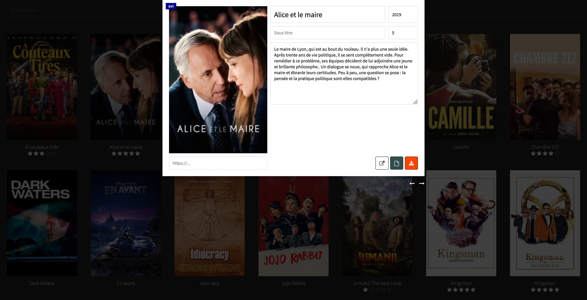
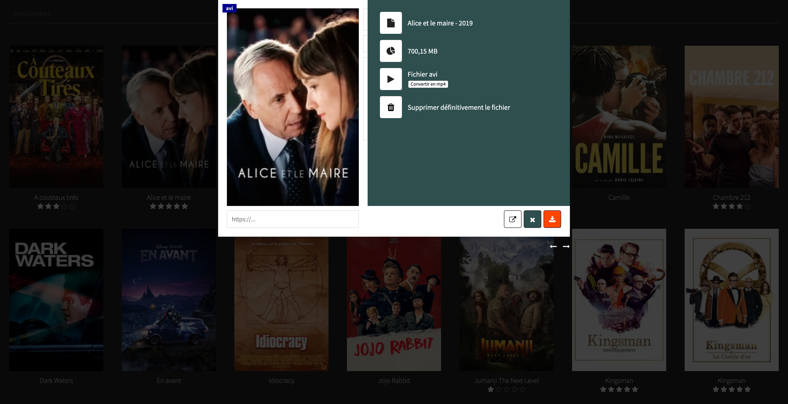

# Mediacenter
An easy way to display your films collection and populate their informations

## Captures
### Home
  

### Modal about film
  

### Modal about video file
  

## Requirements
* [ffmpeg](https://www.ffmpeg.org/) to encode video in mp4

## Install
* Put files into your server  
* Create database table and set it in [Configuration file](config/config.json)  
* Go to the localhost url of the project  
* Drag and drop on window an avi|mkv|mp4 file  

## Todo
* [Application en fullscreen](https://usefulangle.com/post/12/javascript-going-fullscreen-is-rare)
* Optimize mp4 encodding
* include some cool graphics elements
* add tags like action, comedy, adventure, triller, series, etc.
* add comedian informations and filters
* add featured like the fives last uploaded before to display the rest of the collection
* add private comment
* list files data despite they was deleted from disk